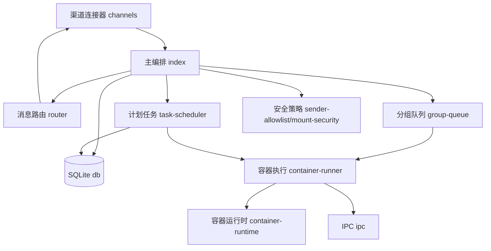
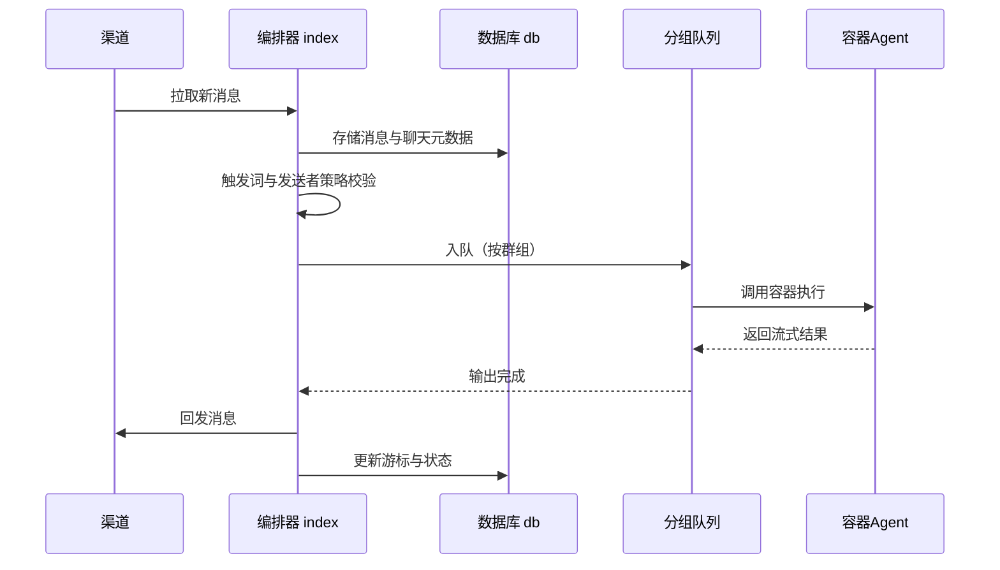
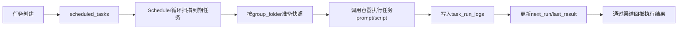

# 第二章 概要设计（NanoClaw）

## 2.1 模块分解

NanoClaw 采用单进程编排架构，核心模块如下：

- 渠道接入模块：位于 src/channels，负责 WhatsApp、Telegram、Slack、Discord、Gmail 等渠道的注册与连接。
- 消息路由模块：位于 src/router.ts，负责消息格式化、内部标签清洗、出站路由。
- 主编排模块：位于 src/index.ts，负责状态加载、消息轮询、触发词判断、分组调度。
- 分组队列模块：位于 src/group-queue.ts，负责每个群组顺序执行与全局并发控制。
- 容器执行模块：位于 src/container-runner.ts 与 src/container-runtime.ts，负责在容器中运行 Agent 与运行时维护。
- 计划任务模块：位于 src/task-scheduler.ts，负责 cron/interval/once 任务调度与执行。
- 数据持久化模块：位于 src/db.ts，负责 chats、messages、scheduled_tasks、task_run_logs、router_state 等数据表访问。
- IPC 与远程控制模块：位于 src/ipc.ts 与 src/remote-control.ts，负责容器与主进程间通信、控制面命令处理。
- 安全与策略模块：位于 src/sender-allowlist.ts、src/mount-security.ts，负责触发权限、挂载安全、来源过滤。

## 2.2 层次结构与调用关系

说明：

- index 是总调度中心，负责把新消息分发到 group-queue。
- group-queue 控制同组串行、跨组并发，避免多组争抢资源。
- task-scheduler 与消息处理共享容器执行能力，执行链路一致。
- db 是系统状态单一事实源，包含会话、任务、游标、分组映射。

## 2.3 关键流程设计

### 2.3.1 消息处理流程

### 2.3.2 计划任务流程

## 2.4 模块接口概要

| 接口模块          | 核心输入                      | 核心输出                       | 说明                       |
| ----------------- | ----------------------------- | ------------------------------ | -------------------------- |
| channels/registry | 渠道工厂注册信息              | 可用渠道实例                   | 启动时自动注册渠道实现     |
| router            | NewMessage 列表               | 标准化 prompt 与 outbound 文本 | 统一消息格式与内部标签剥离 |
| group-queue       | groupJid、执行函数            | 排队执行结果                   | 同组顺序、全局并发受限     |
| container-runner  | group 配置、prompt、sessionId | 流式 ContainerOutput           | 统一 Agent 容器执行入口    |
| task-scheduler    | ScheduledTask                 | 任务执行状态、下次时间         | 支持 once/interval/cron    |
| db                | 业务实体参数                  | 持久化记录/查询结果            | SQLite 单库管理系统状态    |

## 2.5 人机交互与控制界面

NanoClaw 的主要人机交互入口是聊天渠道本身，控制方式包括：

- 主频道控制：用户在 self-chat 中发控制指令（如任务管理、群组管理）。
- 群组触发：群组内通过触发词触发 Agent 执行。
- 技能命令控制：通过 Claude Code 的 slash 技能（如 /setup、/add-telegram、/debug）对系统进行结构化改造。

交互特征：

- 对外界面统一为自然语言消息，不引入额外控制后台。
- 控制操作与业务消息复用同一调度主链路，降低系统复杂度。
- 通过隔离容器与分组目录（groups/\*）保证多群组上下文独立。

## 2.6 主要性能与可靠性设计

- 并发控制：group-queue 避免同组并发冲突，提升结果一致性。
- 调度稳定性：task-scheduler 基于数据库扫描到期任务，支持重启恢复。
- 状态恢复：通过 router_state、sessions、registered_groups 实现断点续跑。
- 安全边界：命令在容器执行，挂载目录受限制，降低宿主机风险。

## 2.7 本章小结

NanoClaw 采用单进程编排 + 容器隔离执行的轻量架构，围绕 渠道接入、消息编排、任务调度、数据持久化 四条主线构建。模块边界清晰，调用链短，易于通过技能机制进行增量改造与定制。
