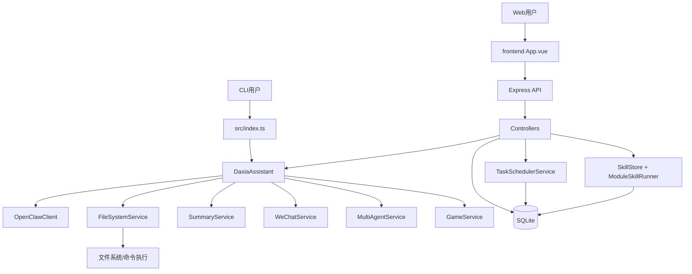
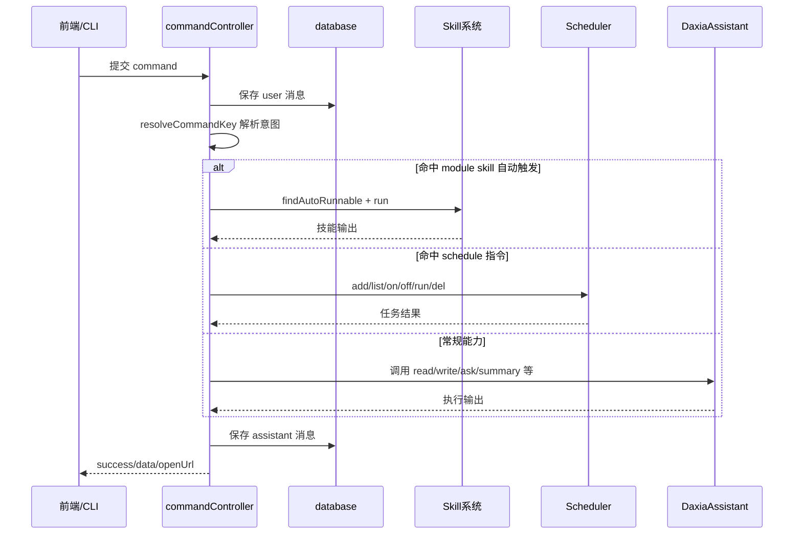
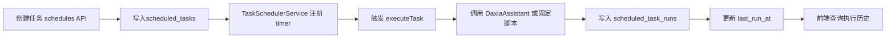

# 第二章 概要设计（SmallClaw）

## 2.1 模块分解

SmallClaw 采用 CLI + Web 双入口、统一后端能力中台的设计。主要模块如下：

- 交互入口模块
- CLI 入口：src/index.ts，提供命令行 REPL。
- Web 服务入口：src/server.ts + src/server/createServerApp.ts，提供 HTTP API。
- 核心能力门面
- DaxiaAssistant：src/assistant.ts，统一封装文件操作、模型问答、总结、微信、多 Agent、小游戏等能力。
- 能力实现模块（assistant_modules）
- core/openClawClient：大模型调用与多提供商切换。
- services/fileSystemService：读写、搜索、命令执行、项目分析。
- services/summaryService：天气/新闻/邮件/会话总结。
- services/weChatService：微信连接与二维码能力。
- services/multiAgentService：多 Agent 协同任务。
- services/gameService：2048 静态资源生成。
- 业务编排模块（server/controllers）
- commandController：统一命令路由与分发。
- conversationController：会话与消息管理。
- skillController：技能增删改查与运行。
- 调度与技能扩展模块
- scheduler/taskSchedulerService：定时任务生命周期管理。
- skills/skillStore：技能注册表管理。
- skills/moduleSkillRunner：JS/Python 模块技能执行。
- 数据持久化模块
- src/database.ts：SQLite 访问层（会话、消息、任务、运行日志）。
- 前端展示模块（frontend/src）
- 聊天模块：features/chat。
- 技能管理模块：features/skills。
- 定时任务模块：features/schedules。

## 2.2 系统层次结构



说明：

- CLI 与 Web 共用同一套后端能力对象，保证行为一致。
- commandController 是 Web 命令总入口，负责意图识别与能力分发。
- 技能系统与调度系统作为横向扩展能力，挂载在同一控制层。

## 2.3 核心调用流程

### 2.3.1 命令执行流程



### 2.3.2 定时任务执行流程



## 2.4 模块接口概要

| 接口分组     | 典型 API                                                  | 输入                                                       | 输出                   |
| ------------ | --------------------------------------------------------- | ---------------------------------------------------------- | ---------------------- |
| 会话接口     | GET/POST/PUT/DELETE /api/conversations                    | conversationId、title                                      | 会话列表、详情、状态   |
| 消息接口     | GET /api/conversations/:id/messages                       | conversationId                                             | 消息列表               |
| 命令接口     | POST /api/command                                         | command、conversationId、modelProvider、modelName、skillId | success、data、openUrl |
| 定时任务接口 | GET/POST/PATCH/DELETE /api/schedules                      | 频率、执行时间、命令、模型参数                             | 任务对象、状态         |
| 任务日志接口 | GET /api/schedules/:id/runs                               | taskId、limit                                              | 执行日志列表           |
| 技能接口     | GET/POST/PUT/DELETE /api/skills, POST /api/skills/:id/run | Skill 定义、task 文本                                      | Skill 列表、执行结果   |
| 健康检查     | GET /api/health                                           | 无                                                         | 服务状态               |

## 2.5 人机界面概要

采用 CLI + Web 双入口：CLI 便于调试自动化，Web 便于可视化交互。

SmallClaw Web 端主要由七个界面单元构成：

- ChatSidebar：会话列表与切换。
- ChatHeader：顶部标题与功能入口。
- ChatMessageList：消息渲染与加载状态。
- ChatComposer：输入、模型选择、技能选择、Craft 模式。
- SkillPanel：技能创建、编辑、删除、运行。
- SchedulePanel：任务创建、启停、删除、查看执行记录。
- ScheduleRunDialog：任务即时执行与日志查看。

界面调用关系：

```mermaid
flowchart TB
  App[App.vue] --> Sidebar[ChatSidebar]
  App --> Header[ChatHeader]
  App --> MsgList[ChatMessageList]
  App --> Composer[ChatComposer]
  App --> Skill[SkillPanel]
  App --> Schedule[SchedulePanel]
  App --> RunLog[ScheduleRunDialog]

  Composer --> CmdAPI[/api/command]
  Sidebar --> ConvAPI[/api/conversations]
  Skill --> SkillAPI[/api/skills]
  Schedule --> SchAPI[/api/schedules]
```

## 2.6 主要性能与可扩展性设计

- 数据性能：SQLite 表建立消息、任务、执行日志索引，保障查询性能。
- 任务稳定性：服务启动时可恢复启用任务，支持即时执行和状态切换。
- 扩展能力：Skill 采用 prompt/module 双模式，便于低成本新增能力。
- 运行一致性：CLI 与 Web 复用 DaxiaAssistant 门面，减少多入口行为偏差。

## 2.7 本章小结

SmallClaw 通过 统一门面 + 控制器分发 + 技能扩展 + 定时调度 的架构，形成了可对话、可执行、可编排、可扩展的轻量智能助手系统。模块层次清晰、接口稳定，便于后续做功能增量和性能优化。
