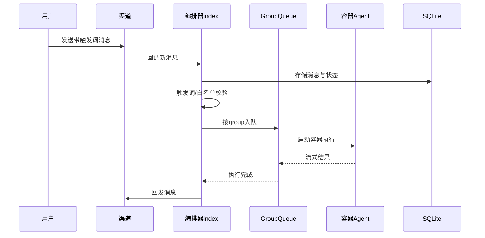
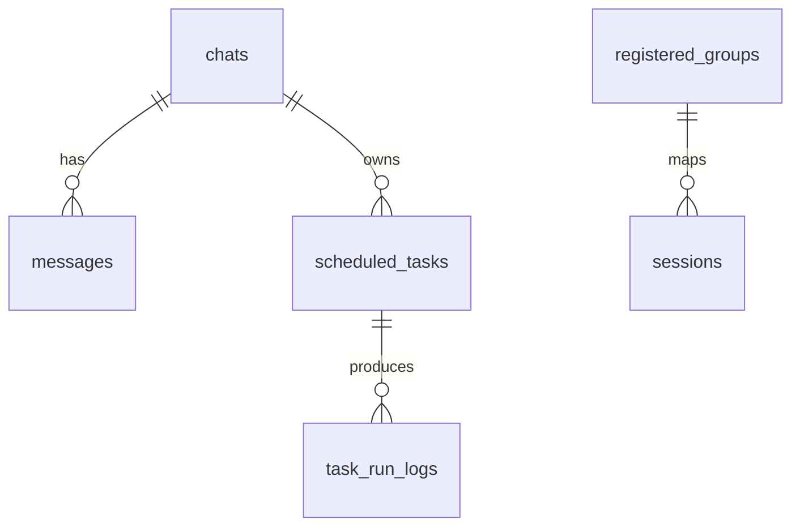

# 第三章 详细设计（NanoClaw）

## 3.1 界面设计

### 3.1.1 交互形态

NanoClaw 不提供独立 Web 控制台，主要采用“聊天即界面”的设计：

- 用户界面：WhatsApp/Telegram/Slack/Discord/Gmail 等渠道对话窗口。
- 管理界面：主频道（self-chat）+ Claude Code 技能命令（如 /setup、/debug）。

该设计减少了传统后台界面开发成本，聚焦自然语言交互与自动执行。

### 3.1.2 典型使用流程

场景 A：群组消息触发 Agent 执行。

场景 B：主频道创建计划任务并自动执行。

## 3.2 数据库设计

NanoClaw 使用 SQLite，兼顾消息持久化与调度状态恢复。核心表如下。

| 表名              | 关键字段                                                                                                  | 说明               |
| ----------------- | --------------------------------------------------------------------------------------------------------- | ------------------ |
| chats             | jid, name, channel, is_group, last_message_time                                                           | 聊天元数据         |
| messages          | id, chat_jid, sender, content, timestamp, is_bot_message                                                  | 消息记录           |
| registered_groups | jid, folder, trigger_pattern, requires_trigger, is_main                                                   | 群组注册与触发策略 |
| sessions          | group_folder, session_id                                                                                  | 容器会话映射       |
| scheduled_tasks   | id, group_folder, chat_jid, prompt, script, schedule_type, schedule_value, context_mode, next_run, status | 定时任务定义       |
| task_run_logs     | task_id, run_at, duration_ms, status, result, error                                                       | 定时任务执行日志   |
| router_state      | key, value                                                                                                | 游标与运行状态     |

ER 关系如下：

### 3.2.1 非完全范式设计与理由

- `scheduled_tasks.schedule_value` 统一用字符串保存 cron/interval/once 参数。
- 理由：减少多类型调度字段分裂，便于同一调度引擎解析；任务规模较小，按类型解析成本低于复杂范式拆表成本。

## 3.3 关键算法与技术实现

### 3.3.1 分组队列并发控制（GroupQueue）

痛点：多群组并发输入时，若同组并行执行容易造成上下文污染与重复回复。

设计：

- 同一群组串行执行（active + pending）。
- 跨群组受 `MAX_CONCURRENT_CONTAINERS` 全局并发限制。
- 任务与消息共用排队器，统一抢占与收敛。

价值：在资源受限条件下保持响应稳定性与上下文一致性。

### 3.3.2 触发词与发送者策略校验

痛点：群聊中无差别响应会导致噪声高、误触发、潜在滥用。

设计：

- 群组默认需要触发词（可配置）。
- 对触发消息执行发送者白名单校验。
- 不满足条件直接跳过，不进入容器执行链路。

价值：降低无效调用与安全风险，控制运行成本。

### 3.3.3 无漂移定时调度（computeNextRun）

痛点：按“当前时间 + 间隔”计算 next_run 会累计漂移。

设计：

- interval 任务基于上次计划时间锚定递推，而非基于 now。
- 当系统暂停后恢复，循环跳过已错过的区间，直接定位未来最近执行点。

价值：长期运行下任务时点稳定，不随执行耗时逐步偏移。

### 3.3.4 容器隔离与挂载安全

痛点：AI Agent 具备命令执行能力，若直接运行在宿主机风险高。

设计：

- Agent 在 Linux 容器运行。
- 额外挂载遵循 allowlist 与 blockedPatterns。
- 非主群组默认只读挂载，主群组保留更高控制权限。

价值：实现“可执行”与“可控安全”的平衡。

## 3.4 技术创新点（简述）

- 聊天即界面：将管理与执行统一到消息通道，减少传统后台依赖。
- 技能化扩展：通过 Claude Code 技能改造系统，而非堆叠臃肿功能开关。
- 单进程 + 容器隔离：在保持系统简洁的同时，保留强安全边界。

## 3.5 本章小结

NanoClaw 详细设计围绕“多渠道输入、队列化编排、容器化执行、状态可恢复”展开。其重点难点在于并发控制与安全隔离，最终通过分组队列、触发策略、无漂移调度与挂载治理形成稳定闭环。
