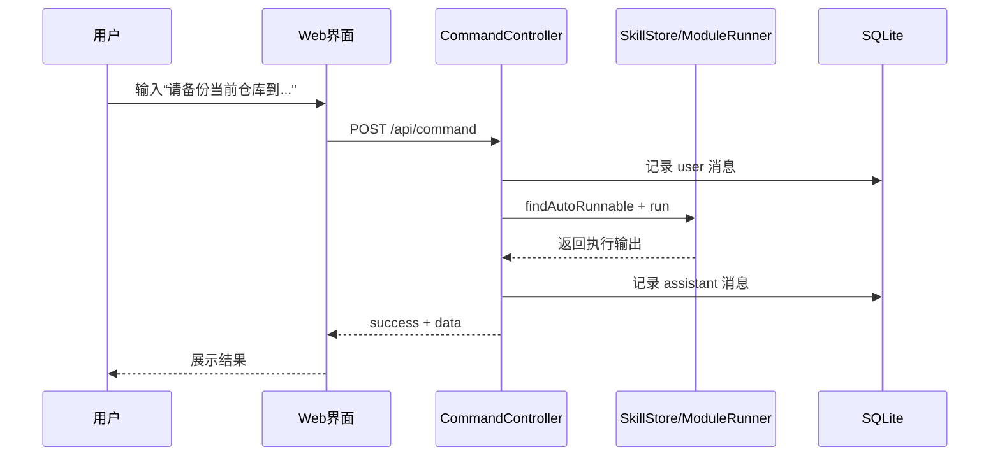
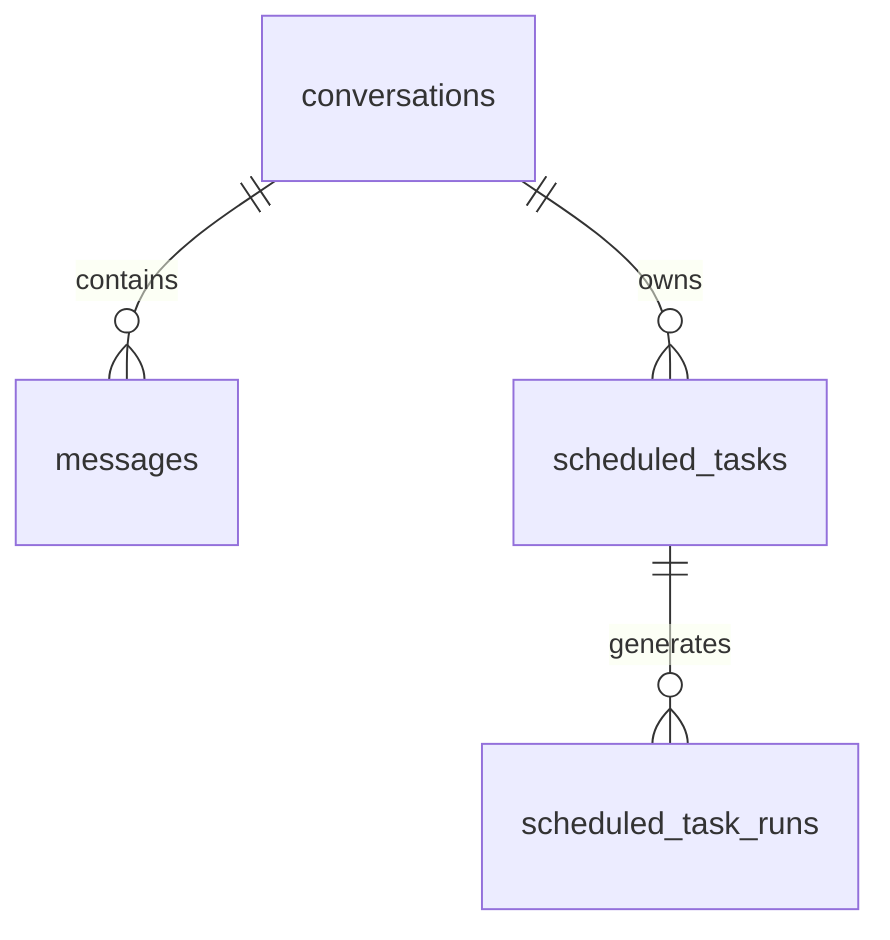

# 第三章 详细设计（SmallClaw）

## 3.1 界面设计

### 3.1.1 交互入口

系统采用 CLI + Web 双入口：

- CLI：适用于开发调试、批量命令执行、低资源环境。
- Web：适用于可视化会话管理、技能配置、定时任务维护。

两种入口共用同一后端能力（DaxiaAssistant + API 控制层），保证行为一致，避免“同一命令不同入口结果不一致”的问题。

### 3.1.2 Web 界面模块

Web 主界面由以下组件构成：

- ChatSidebar：会话创建、切换、删除。
- ChatHeader：标题及技能/定时任务入口。
- ChatMessageList：消息显示、Markdown 渲染、加载态。
- ChatComposer：输入、模型选择、Skill 选择、Craft 模式。
- SkillPanel：Skill 的新增、编辑、删除、运行。
- SchedulePanel：定时任务创建、启停、查看历史。
- ScheduleRunDialog：任务立即执行与日志回看。

### 3.1.3 典型使用流程

场景 A：用户发送自然语言请求并自动触发模块 Skill。

场景 B：用户在定时任务面板创建“每日摘要”。

## 3.2 数据库设计

SmallClaw 使用 SQLite，核心表如下。

| 表名                | 关键字段                                                                                                               | 说明                  |
| ------------------- | ---------------------------------------------------------------------------------------------------------------------- | --------------------- |
| conversations       | id, title, created_at, updated_at                                                                                      | 会话主表              |
| messages            | id, conversation_id, role, content, qr_code, created_at                                                                | 会话消息（用户/助手） |
| scheduled_tasks     | id, conversation_id, command, model_provider, frequency_type, interval_seconds, time_of_day, weekdays, run_at, enabled | 定时任务定义          |
| scheduled_task_runs | id, task_id, success, output, executed_at                                                                              | 定时任务执行日志      |

ER 关系如下：

### 3.2.1 非完全范式设计与理由

- `scheduled_tasks.weekdays` 使用逗号分隔字符串而非独立子表。
- 理由：任务读取频率远高于复杂查询，字符串存储可降低建模与序列化成本，保持单表增删改简洁；在当前规模下性能可接受。

## 3.3 关键算法与技术实现

### 3.3.1 命令意图解析（resolveCommandKey）

痛点：用户输入既可能是显式命令，也可能是自然语言表达（如“帮我生成 2048”）。

设计：

- 先解析首词（如 `schedule`、`agents`）。
- 再结合正则语义特征识别隐式意图（多 Agent、2048、定时任务）。
- 最终统一映射为标准命令键，交给控制器分发。

价值：降低用户学习成本，避免“必须背命令”的交互门槛。

### 3.3.2 模块 Skill 自动触发

痛点：纯 Prompt Skill 执行能力受限，本地自动化（文件、脚本）难闭环。

设计：

- SkillStore 维护 `auto_triggers`。
- 命令控制层在非显式命令下优先匹配 module Skill。
- ModuleSkillRunner 支持 JS 与 Python 双执行路径，并统一输出。

价值：把“自然语言 -> 本地动作”打通，形成可执行智能体能力。

### 3.3.3 定时任务调度与归一化

痛点：daily/interval/once 三类任务参数差异大，容易出现非法时间、漏执行。

设计：

- 在路由层做频率参数归一化与校验。
- 在服务层统一转换为可调度实体，启动时自动恢复已启用任务。
- 每次执行写入 `scheduled_task_runs`，并回写 `last_run_at`。

价值：可追溯、可恢复、可运营，满足长期自动化执行需求。

### 3.3.4 统一门面架构

痛点：CLI 与 Web 分别实现能力易产生重复代码与行为漂移。

设计：所有核心能力只在 DaxiaAssistant 内实现，CLI 与 Web 仅作为入口层。

价值：开发维护成本低，测试范围收敛，功能扩展时不需要双线改造。

## 3.4 本章小结

SmallClaw 的详细设计聚焦“多入口一致性、可执行扩展、可追溯调度”三大目标。通过组件化界面、轻量数据库模型与关键控制算法，实现了从对话到执行、从临时请求到定时任务的完整闭环。
