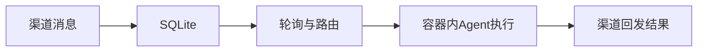

# 第五章 安装及使用（NanoClaw）

## 5.1 安装环境要求

| 项目       | 要求                                             |
| ---------- | ------------------------------------------------ |
| 操作系统   | macOS 或 Linux                                   |
| Node.js    | 20 及以上                                        |
| 必备工具   | Claude Code                                      |
| 容器运行时 | Apple Container（macOS）或 Docker（macOS/Linux） |
| 包管理器   | npm（项目默认）                                  |

## 5.2 默认安装流程

### 5.2.1 获取项目

1. 克隆仓库：git clone https://github.com/qwibitai/nanoclaw.git
2. 进入目录：cd nanoclaw

### 5.2.2 安装依赖与初始化

1. 启动 Claude Code：claude
2. 在 Claude 交互中执行：/setup
3. 按提示完成依赖安装、渠道认证、容器配置。

### 5.2.3 可选配置

1. 按需执行扩展技能（如 /add-whatsapp、/add-telegram、/add-gmail）。
2. 如需切换容器运行时，可执行 /convert-to-apple-container（macOS）。

说明：

- 以 / 开头的命令为 Claude Code 技能命令，应在 claude 提示符中执行。
- /setup 为默认安装路径，适合首次使用。

## 5.3 启动与运行

安装完成后，系统通常按单进程编排运行，核心链路如下：

### 5.3.1 默认运行

- 推荐方式：执行 claude 后通过已配置渠道进行交互。
- 消息处理主链路：渠道 -> SQLite -> 轮询路由 -> 容器 Agent -> 回发结果。

### 5.3.2 开发验证

- 构建：npm run build
- 开发运行：npm run dev
- 测试：npm run test

## 5.4 典型使用流程

### 流程 A：主频道控制

1. 在主频道发送管理请求（如查看任务、暂停任务）。
2. 系统解析为控制指令并执行。
3. 返回任务状态或执行结果。

### 流程 B：群组触发执行

1. 在已注册群组发送带触发词消息。
2. 系统进行触发词与发送者策略校验。
3. 通过队列进入容器执行并回发结果。

### 流程 C：按需扩展渠道

1. 在 Claude 中执行 /add-whatsapp 或 /add-telegram。
2. 完成认证后渠道自动纳入编排。
3. 新渠道与既有任务体系共享同一后端能力。

## 5.5 常见问题（简要）

- /setup 无法完成：优先执行 /debug 检查环境与认证状态。
- 消息未触发：检查群组触发词、发送者策略和渠道连接状态。
- 定时任务未执行：检查任务状态、next_run 字段与容器运行状态。

## 5.6 本章小结

NanoClaw 默认安装以 /setup 为核心，强调“聊天即界面、容器内执行、技能化扩展”。默认路径覆盖从初始化到渠道接入，典型流程覆盖主频道管理、群组触发和能力扩展，便于快速落地。
